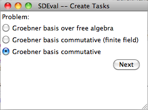
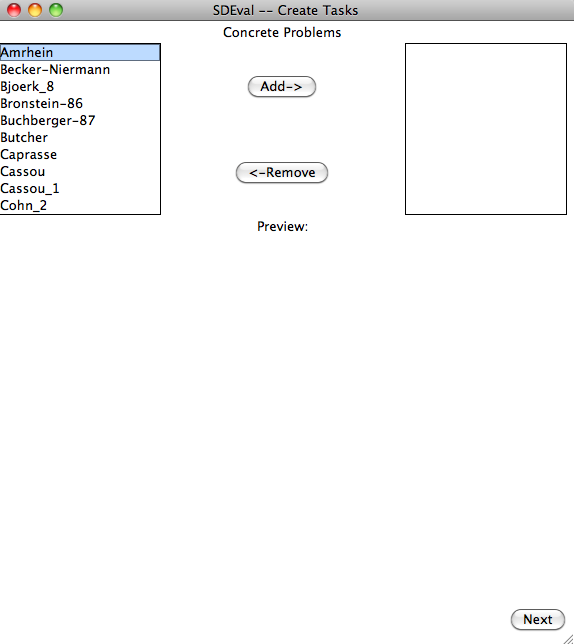
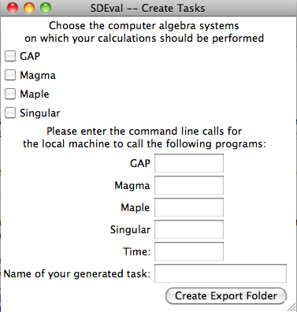

.. _SDEval:

Quick manual for users of SDEval
================================

Author: Albert Heinle <albert.heinle@googlemail.com>

Abstract
--------

This document describes how to use the programs in this project for
your everyday life.

For clarification on some denotation used in this document, consider
the `definitions`

What is SDEval
--------------

SDEval is a collection of tools that can be used for benchmarking
several computer algebra systems on different computation problems
given problem instances from the Symbolic Data project.

It can be used to produce executable code for computer algebra
systems, even a collection of them, and to run and time measuring them
on different machines.

How can I use SDEval
--------------------

You can use ``SDEval`` to create a task that you want to run on a
certain machine. Furthermore, the execution of the task is also done
by ``SDEval``.

Creating a Task
---------------

The most handy way to do so is to use the graphical user interface.
Fot that, just execute ::

  $ python create_tasks_gui.py

on your machine. The first window that pops up shows the collection of
currently provided computation problems.

   Selection of the provided computation problems.

You choose one, and click next. Then a window similar to the following
appears.

   Selection of problem instances from Symbolic-Data

There, you can choose certain problem instances you want to have
calculations to be run at. For a preview, simply double click on an
entry in the left list box. If you want to add it, mark it and click
the add button. Once you have selected all problem instances you want
to use, click a last time on the ``Next``-Button.

Then a window appears, where you can select different computer algebra
systems.

   Selection of computer algebra systems and setting the commands

Additionally, you have to add the commands to execute the selected
computer algebra systems on your target machine. Also for a time
command ist asked, which is on most ``UNIX``-Like machines simply
``time``. After giving your task a name, you can click on the
``Create``-Button, and then you will be asked where to save the
taskfolder. Select a location. After that, the program creates a
taskfolder in the specified path.

.. note:: All those steps can also be done using the command line. For
   that, simply execute ::

     $ python create_tasks.py

Executing a Task
----------------

Once you have created a task as described above, move to the
taskfolder. There, you can execute the task by running the command ::

  $ python runTasks.py

.. note:: You can also add time constraints and memory usage
   constraints. You can find out how to do that by typing ::

     $ python runTasks.py --help

After you do that, your computer seems to be working. But you do not
know what it is doing. The answer is: It is executing all files on the
corresponding computer algebra systems, which might take a while.

To see the proceedings of the computations, go into the subfolder
``results``, which is created after the first running, and select
the folder with the name representing the current timestamp. In there,
you find a HTML-file called proceedings.html. Open it, and see which
computations are waiting, running and which are completed.

For the completed, you can open resultedtimings.html, where you can
see how long the calculation took.

That is it. Have fun using it!!!
